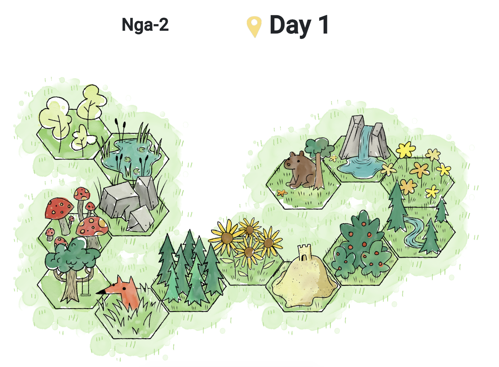

# H1 Jolene's Porfolio 

### React Native

**Kitchen Library App**

A cross-platform mobile application that allows residents in a shared building to borrow and return kitchen appliances conveniently. Designed to promote community sharing and reduce waste, the app features a user-friendly interface for browsing available items, checking appliance availability, placing reservations, and managing borrow/return history. Built using React Native, MySQL, Django, Node, Objective-C, Java, RESTful APIs, SASS, Git.

<video width="320" height="240" controls>
  <source src="https://github.com/jolenele/jospace/blob/master/img/AndroidOpenApp.mov" type="video/mp4">
</video>

This is the Landing Screen from an Android device. This demo is before I optimized the loading time.

<video width="320" height="240" controls>
  <source src="/img/AndroidOpenApp.mov" type="video/mp4">
</video>

This is a demo to client how a new user can create accounts with the running app.

### Angular

[Link](https://leagueforgreenleaders.springbaystudio.org/)

League for Green Leaders — A gamified, climate-action competition platform for Grades 3–8. Participants join interactive two-week seasons of daily learning activities—both online and offline—that help them make greener lifestyle choices, track their CO₂ savings, and compete with peers globally.

<video width="320" height="240" controls>
  <source src="./img/homepage.mov" type="video/mp4">
</video>

Tech Stack: Angular, TypeScript, HTML, CSS/SCSS, RESTful APIs, Bootstrap, MySQL, PHP Laravel, Git.

As the sole frontend developer, I led the development and optimization of the League for Green Leaders. I collaborated closely with the business analyst to design intuitive UI components, implemented responsive layouts for cross-device compatibility, and improved performance by identifying and addressing rendering bottlenecks. My work contributed to a 15% increase in user retention and a 40% improvement in load times, while also supporting backend integration through API restructuring.

This is the Interactive Activity Map as seen from the student view. Each tile corresponds to a specific day’s activities. Once all activities are completed, the tile becomes unlocked.

This is the Interactive Activity Map as seen from the teacher view, where all the tiles have been opened. 

### React

**Badminton Scoreboard App**

A responsive web application designed to track and display badminton match scores in real time. The app supports match setup, live score updates, and match history storage, making it ideal for casual games or tournaments. This is a personal project I built as a hobby.

Built using React for the frontend, Node.js and Express for the backend, and MongoDB for data storage.

<video width="320" height="240" controls>
  https://raw.githubusercontent.com/jolenele/jospace/master/img/badminton.mov
</video>

<video width="320" height="240" controls>
  <source src="/jospace/img/badminton.mp4" type="video/mp4">
</video>
